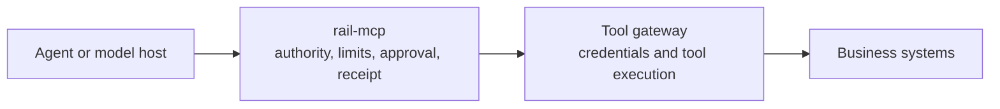

The Rail decides whether an agent may take an action, and proves afterwards what it was allowed to do. It does not run your action, host your tools, or hold your agent's credentials to other systems. Your code performs the effect; the Rail issues the permit and the receipts.

## Choose an integration point

| Your agent acts through | Integrate with | Guide |
| --- | --- | --- |
| Code you write (TypeScript or Python) | The governed helper: wrap the effect in `rail.govern(...)` | [TypeScript](/sdks/governed-typescript), [Python](/sdks/governed-python) |
| Scripts, jobs or shell commands | `rail govern ... -- <command>` | [Govern a shell command](/cli/govern) |
| Tool calls through an MCP server | `rail-mcp` in front of the server | [Govern MCP tool calls](/sdks/mcp-proxy) |
| Your own HTTP client | The customer API: actions, capabilities, executions | [Governed execution](/guides/governed-execution) |

All four use the same authority model, declared once in `rail.yaml`: the resources an agent may touch, the tenant's ceilings, each action's value and approval threshold, and the principals involved.

## What the Rail decides, and what it doesn't

| The Rail decides | The Rail does not |
| --- | --- |
| Whether this action is within the grant: resource, value, uses, delegation depth | Run the action. Your code or adapter performs it under the permit |
| Whether a person must approve first | Store or broker credentials to third-party systems |
| Whether authority still holds at the moment of action, including after revocation | Host a catalog of tools |
| What evidence the action leaves: signed receipts a third party can verify offline | Decide what the model should do next |

## Alongside tool gateways and credential brokers

Tool gateways and credential brokers answer a different question: can the agent reach a system, and as whom? The Rail answers whether it may take this action, within these limits, and how to prove it. They stack:

Because `rail-mcp` proxies any MCP server, it can sit in front of a gateway that exposes its tools over MCP. The gateway keeps handling sign-in and tool execution; the Rail governs each call and records it. Map only the tools that spend, commit or change something, and keep `default: deny` for the rest.

## The other side of the transaction

A supplier, payment provider or auditor does not need a Rail account to rely on what your agent did. Export the journey and give them the bundle and trust card; they verify it offline with `rail verify`. See [verify evidence](/guides/verify-evidence).

## Current limits to plan around

- **Credentials per role.** The agent, worker and operator each authenticate with their own client certificate (mTLS). Plan identity setup before the first governed call.
- **One effect per grant per resource and action.** A grant, with everything delegated under it, acts on each resource × action once. For repeated actions, issue a grant per journey; in development, use `--own-authority`.
- **Authorization is asynchronous.** The helper submits the execution and polls until it is authorized, held or denied. Account for that wait in agent loops.
- **No framework adapters yet.** There are no packaged adapters for specific agent frameworks. Wrap the framework's tool function with the governed helper, or put `rail-mcp` in front of its MCP tools.
